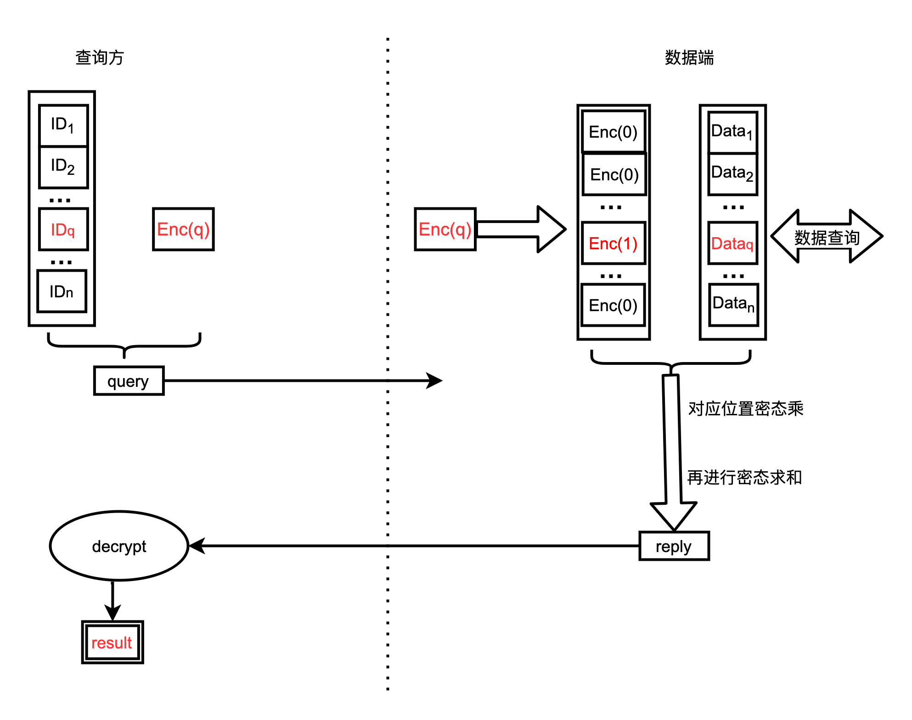

# PIR：匿踪查询算法库。

PIR是匿踪查询的缩写，它可以是一种保护隐私的数据查询协议。包括查询方和数据方两个参与方，查询方拥有想要查询的数据ID，数据方拥有数据ID及ID对应的数据值。双方执行完成该协议后，查询方获得数据ID在数据方数据库中对应的数据值，但数据方不知道查询方查询了哪条数据。本算法库对匿踪算法进行抽象，提供一种更加简单易集成的的算法库，基于SEAL的匿踪查询算法。
另外为了对上层提供更加友好的对接方式，本库还支持swig编译，以向其他编译语言提供支持。

## 算法介绍

#### 基于SEAL的匿踪查询



为了更方便理解，本方案中也以单条查询为例，在后文中会介绍其如何简易的拓展为批量。
初始化：查询方会生成同态加密公钥和私钥。

step1-产生密文请求：
查询方会使用SEAL库加密真正查询数据所在位置q，并将位置密文和查询集发送给数据方。

step2-产生密文回应：
a. 数据方根据[SEALPIR](https://eprint.iacr.org/2017/1142.pdf )算法将位置密文拓展成密文向量。
b. 数据方查询获得所有索引对应的数据，并将其放在对应位置上。使用拓展出的密文向量对应位置进行密态乘计算，在将获得的所有结果进行密态求和，可以看出仅剩下q位置上的数据，不过是密态形式存在。并将密态求和结果发送给查询方。

step3-解密获得结果
查询方使用私钥解密密文获得查询结果。

说明：
a. 在实际使用过程中密文长度固定，比如4096安全强度时，BFV密文长度为60KB左右，即使加密1Byte数据也会占用较大数据空间，这导致了密文空间浪费的现象。并且BFV单条密文最大容纳10KB的明文，在数据宽度较小时需要考虑这个问题。
b. 批量拓展：同样将查询列表拓展为查询矩阵，生成一个Enc(q)，数据方将查询数据按照位置进行存放和拼接，再进行密态乘和密态求和，最后查询方解密密文获得查询结果。这里需要注意当数据量过大时，需要将数据切割，会产生多个密文结果，查询方分别解密后组成一个长数据再按照规则切割。


## 编译安装

1. seal 4.0.0

   ```bash
   wget https://github.com/microsoft/SEAL/archive/refs/tags/v4.0.0.zip
   unzip v4.0.0.zip
   cd SEAL-4.0.0
   cmake -S . -B build
   cmake --build build
   sudo cmake --install build
   ```

2. swig

   ```bash
   git clone https://github.com/swig/swig.git
   cd swig-go
   ./configure 
   make
   make -j8
   ```

## 测试

#### C++编译

```bash
cd /cpp
cmake -S . -B build
cmake --build build
#会生成cgo和cjava两个文件夹，需要将需要的文件分别copy到需要的编译环境中。
```

#### cgo测试

   ```bash
#相关依赖会出现在cpp/cgo目录下。
cp cgo/pir.go libpir-go-arm64.dylib ../go/lib
#进行测试
cd ../go
DYLD_LIBRARY_PATH="${your lib path}"; CGO_LDFLAGS="${your lib path} -lpir-go-arm64" go run main.go

#将编译后的libpir-go-arm64.lib和pir.go从pir/cpp/cgo中移动到go工程中。
#go文件import对应的文件，接下来设置lib路径。
#若使用IDE工具可以设置环境变量。
DYLD_LIBRARY_PATH=${your lib path};CGO_LDFLAGS=-L${your lib path} -lpir-go-arm64;
#若直接执行可以使用
DYLD_LIBRARY_PATH="${your lib path}";CGO_LDFLAGS="-L${your lib path} -lpir-go-arm64" go run main.go
   ```

#### Java测试

```bash
#相关依赖会出现在cpp/cjava目录下。
cp cjava/libpir-java-arm64.dylib ../java/resource
cp cjava 中其他文件到java/src/pir中
```

